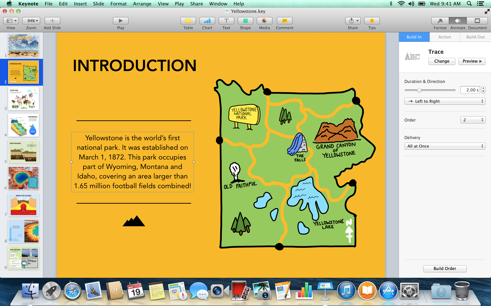
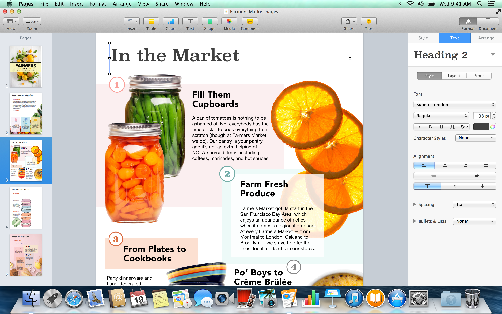
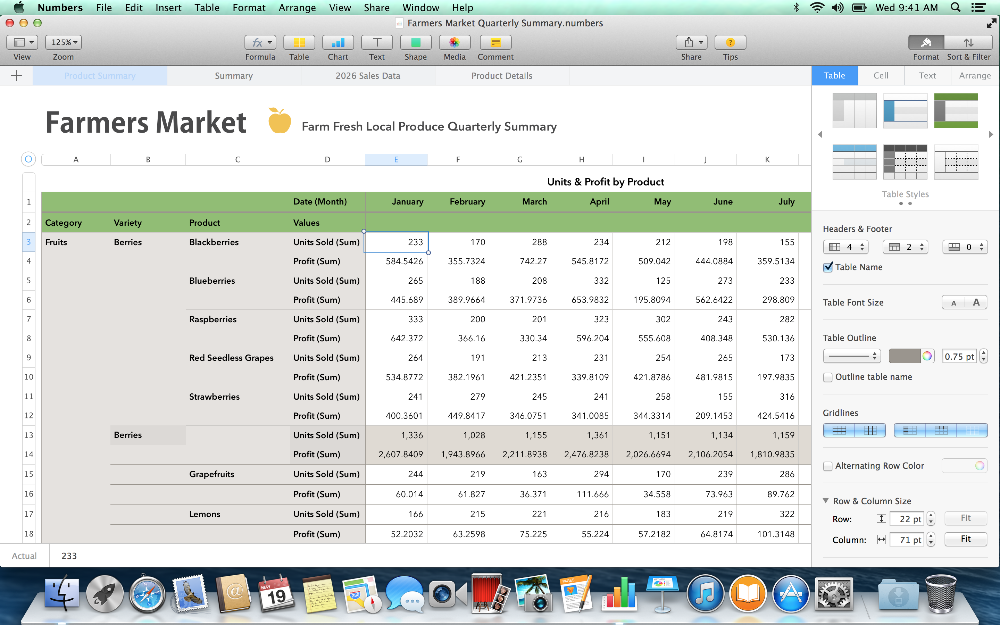
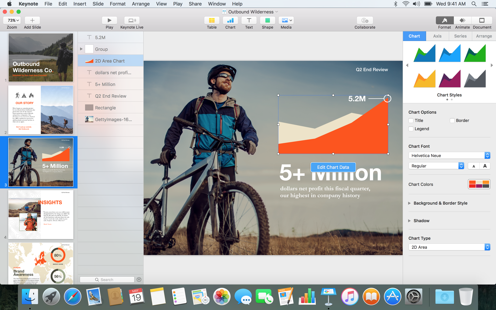

# MavericksAppCompatibilityLayer

Run apps that were built for OS X 10.10 Yosemite (or later) on OS X
10.9 Mavericks. **Out of the box, this repo patches the May 2016
release of Apple's iWork apps**, Keynote 6.6.2, Pages 5.6.2, and
Numbers 3.6.2 (compiled against the El Capitan SDK with a Yosemite
deployment target), so they launch and run on Mavericks.
**Jump to [Quick Start](#quick-start)** if
you just want to patch iWork and go.

Want to run a *different* newer-than-Mavericks app? You can extend
this tool to a new target by pairing it with
[Claude Code][cc-top]. If you're a Mac power user, you can do
it. See
**[Want to run a different app on Mavericks?](#want-to-run-a-different-app-on-mavericks)**
below.

[cc-top]: https://claude.com/claude-code

If you're a technical reader curious about **how** this was
built, [`JOURNEY.md`](JOURNEY.md) is the long-form read, a
checkpoint-by-checkpoint walkthrough from "won't even load" to
"running cleanly," with every non-obvious decision called out.







---

## Quick Start

### What you need

1. A Mac running OS X 10.9 Mavericks.
2. One or more of these apps, in their last-Yosemite-supporting
   versions:
   - **Keynote 6.6.2**, [archive.org/details/keynote-6.6.2][k662]
   - **Pages 5.6.2**, [archive.org/details/pages-5.6.2][p562]
   - **Numbers 3.6.2**, re-download from the **Purchased** tab of
     the Mac App Store on OS X Yosemite. If you don't have a
     newer-vintage Mac that's still running Yosemite, you can also
     coax the modern Mac App Store on a current Mac into handing
     you an older build with
     [Downgrade-MAS-Applications](https://github.com/nghlt/Downgrade-MAS-Applications).
     If you end up with a copy, please consider uploading it to
     archive.org and opening a pull request to add the link here.
     More generally, please archive more old apps. The longer this
     stays "ask a friend who still has a Yosemite Mac," the more
     of this software disappears for good.

[k662]: https://archive.org/details/keynote-6.6.2
[p562]: https://archive.org/details/pages-5.6.2

### Step 1: Download this repo on the Mavericks Mac

The version of Safari that shipped with Mavericks won't open
modern sites like github.com. You
need an up-to-date browser on the Mavericks Mac first. The
easiest option is
**[Momiji](https://github.com/aobaharuki2005/momiji-web-browser)**,
a Firefox LTS backport maintained for older macOS. Grab the
`.zip` from its **Releases** page on another Mac, transfer it
to the Mavericks Mac (USB stick or any other shared-folder
route you have), double-click
the `.zip` to unzip it, drag the resulting `Momiji.app` into
`/Applications`, and launch it.

Then, in Momiji on the Mavericks Mac, open:

> **[Download MavericksAppCompatibilityLayer-main.zip][dl]**

[dl]: https://github.com/nfzerox/MavericksAppCompatibilityLayer/archive/refs/heads/main.zip

After the download finishes, find
`MavericksAppCompatibilityLayer-main.zip` in your Downloads folder
and double-click it to unzip. You should end up with a folder
called `MavericksAppCompatibilityLayer-main`.

### Step 2: Open Terminal

Press `⌘-Space` to open Spotlight, type **Terminal**, and press
Return. A window with a command prompt opens. Don't worry, you
only need to paste a few short lines.

### Step 3: Point Terminal at the downloaded folder

Type the two characters `cd` followed by **a space** into the
Terminal window. **Don't press Return yet.** Then drag the
`MavericksAppCompatibilityLayer-main` folder from Finder onto
the Terminal window, the full path is filled in for you. Now
press Return.

You're now "inside" the folder from Terminal's perspective.

### Step 4: Patch each app

For each iWork app you want to patch, type the following (note
the **trailing space**), then drag the app from `/Applications`
(in Finder) onto the Terminal window, then press Return:

```
./install_iwork2015.sh 
```

After dragging Keynote, the line you actually run looks like:

```
./install_iwork2015.sh /Applications/Keynote.app
```

The script will most likely ask for your Mac login password
(because it needs to write inside `/Applications`). Type it and
press Return. **You will not see the password as you type, no
dots, no asterisks. That's normal; your keystrokes are still
being registered.**

Repeat for Numbers and Pages:

```
./install_iwork2015.sh /Applications/Numbers.app
./install_iwork2015.sh /Applications/Pages.app
```

Each run takes a few seconds. When you see a final `==>
Successfully patched ...` line, that bundle is done.

### Step 5: Launch

Double-click the patched app from Finder (or `open
/Applications/Keynote.app` in Terminal). The patched bundle is
fully self-contained, you can copy it elsewhere on the same
Mavericks Mac and it will keep working.

### Undoing the patch

The script saves the original main binary as `<App>.orig`
alongside the patched one. To revert, paste these three lines
into Terminal:

```
APP=/Applications/Keynote.app
cp "$APP/Contents/MacOS/Keynote.orig" "$APP/Contents/MacOS/Keynote"
codesign --force --deep --sign - "$APP"
```

---

## Want to run a *different* app on Mavericks?

The compatibility layer above is a worked example for iWork
2015. The underlying mechanism generalizes: any app built for
10.10 / 10.11 / 10.12 that fails on Mavericks because it
references newer-OS symbols can in principle be patched the
same way. The hard part is the back-and-forth loop (launch
it, see what crashes, write a stub, repeat), and that's
exactly the loop a modern code agent is good at.

**If you're a Mac power user, you can do it.** You
need to install Claude Code, paste a few commands, and click
around the patched app on Mavericks to report what looks
wrong. This repo's [`AGENTS.md`](AGENTS.md) is written
specifically so a fresh agent can pick up the toolchain
without you re-explaining it.

> **Hardware:** this path needs an **Intel Mac released in
> 2013 or earlier** that can boot OS X Mavericks, set up as
> a **multi-boot with both Mavericks and the target OS** on
> separate partitions. The pipeline has to read framework
> binaries and SDK headers from *both* OSes, which means
> real installs of each. Apple Silicon Macs cannot boot any
> 10.x release, so the Apple Silicon Mac you run Claude
> Code on doesn't substitute for the vintage Intel Mac. See
> [`AGENTS.md`](AGENTS.md) for the full multi-machine setup,
> including the APFS / 10.13+ wrinkle.

> **Subscription:** this path requires a Claude
> subscription. The **Pro** tier should be enough for a
> simple port; complicated ports (large apps, many missing
> symbols, multi-day iteration) may need **Max**.

### TL;DR (if you're already comfortable on the command line)

```
git clone https://github.com/nfzerox/MavericksAppCompatibilityLayer.git
cd MavericksAppCompatibilityLayer
claude
```

Then paste this prompt to Claude:

> Study this repository carefully (`README.md`, `AGENTS.md`,
> and especially `JOURNEY.md` plus `memory/MEMORY.md`), then
> expand it so I can run **`<App.app>`** on OS X Mavericks. The
> May 2016 iWork build is already working; use it as the
> template and follow the same approach for my app. When the
> app launches and runs, help me share it as a fork and open
> a pull request against the upstream repo so other people can
> use it too.

Replace `<App.app>` with the actual app. Be specific: include
the version number, where you downloaded the app from, and the
exact message Mavericks shows when you double-click the app on
the Mavericks side of your Intel Mac. Mavericks refuses to
launch a newer-OS app outright with a dialog along the lines of
*"You can't open the application because it requires OS X 10.X
or later."* That OS-X-version number is the most useful thing
to tell Claude up front.

### Step-by-step (for users new to the Terminal)

**What you'll need:**

- **An Apple Silicon Mac** (M-series, running any modern
  macOS) to run Claude Code on. This is where the agent
  lives and where you'll be typing commands.
- **A vintage Intel Mac released in 2013 or earlier**, set
  up as a **multi-boot** with both **OS X Mavericks (10.9)**
  and the **target OS** the app needs (10.10 / 10.11 / 10.12
  / ...) on separate partitions, each with the appropriate
  Xcode installed. Almost all of the actual work (reading
  framework binaries, building the stub dylib, patching and
  re-signing the target app) happens **on this Mac** — the
  agent on the Apple Silicon side just drives the Mavericks
  Mac over SSH. Both Macs on the same Wi-Fi network is the
  simplest setup.
- **[Claude Code][cc]** installed on the Apple Silicon Mac,
  and a paid Claude subscription. Claude Code is Anthropic's
  official command-line coding agent; install instructions
  are at [claude.com/claude-code][cc]. A **Pro** subscription
  should be enough for a small port (a few hours of
  iteration); a **Max** subscription is more comfortable for
  a complicated port (large app, many missing symbols, many
  evenings of debugging). The free tier won't get you very
  far on a real porting session.
- **The app you want to patch**, in a version that fails on
  Mavericks. (If it already runs on Mavericks, you don't need
  any of this.)
- **A free [GitHub](https://github.com/join) account** so you
  can fork the repo and open a pull request when you're done.

[cc]: https://claude.com/claude-code

> **Don't have the multi-boot Intel Mac set up yet? That's
> fine.** Once you've started Claude Code with the prompt in
> Step 4 below, just tell it "I don't have the multi-boot Mac
> set up yet, please walk me through it." The agent has full
> setup notes in [`AGENTS.md`](AGENTS.md) (which Intel Macs
> can boot both OSes, which Xcode version to put on each side,
> how to partition the disk, the [xcodereleases.com](https://xcodereleases.com/)
> SDK lookup, the APFS / 10.13+ HFS+ copy step, screen-sharing
> tips for copying crash text back and forth). It will guide
> you step by step. You don't need to figure any of the
> machine-prep out alone before opening Claude Code.

**Steps (run these on the *current* Mac, not the Mavericks Mac):**

1. **Make a GitHub account, then fork the repo.** If you don't
   already have one, sign up at
   [github.com/join](https://github.com/join), it's free. Once
   you're signed in, visit
   [github.com/nfzerox/MavericksAppCompatibilityLayer](https://github.com/nfzerox/MavericksAppCompatibilityLayer)
   and click **Fork** (top right). GitHub will copy the repo
   into your account.

2. **Clone your fork.** Open Terminal (⌘-Space, type
   **Terminal**, Return) and paste each of these lines one by
   one, replacing `<your-github-username>` with your actual
   GitHub username:

   ```
   mkdir -p ~/Developer && cd ~/Developer
   git clone https://github.com/<your-github-username>/MavericksAppCompatibilityLayer.git
   cd MavericksAppCompatibilityLayer
   ```

   If Terminal says `git: command not found`, run
   `xcode-select --install` first to get the Xcode command-line
   tools, click through the installer, then retry the `git
   clone` line.

3. **Start Claude Code in this folder.** Still in Terminal,
   paste:

   ```
   claude
   ```

   A Claude prompt appears in the same window. If `claude`
   isn't found, follow the install instructions at
   [claude.com/claude-code][cc] and try again.

4. **Give Claude the prompt.** Paste this into the Claude
   prompt, with `<App.app>` replaced by your target app:

   > Study this repository carefully (`README.md`,
   > `AGENTS.md`, and especially `JOURNEY.md` plus
   > `memory/MEMORY.md`), then expand it so I can run
   > **`<App.app>`** on OS X Mavericks. The May 2016 iWork
   > build is already working; use it as the template and
   > follow the same approach for my app. When the app
   > launches and runs, help me share it as a fork and open
   > a pull request against the upstream repo so other
   > people can use it too.

   Include the version number and where you downloaded the
   app from. The more specific you are, the better Claude
   can plan.

5. **Be the eyes and hands.** Claude can edit files on the
   current Mac, but it can't see what the patched app looks
   like running on Mavericks. You'll need to help with:

   - **SSH access** from your current Mac to the Mavericks Mac
     so Claude can install, patch, and test without you
     copy/pasting between machines. Simplest path: on the
     Mavericks Mac, enable **Sharing → Remote Login** in
     System Preferences, then find its IP (it'll be shown in
     that same Sharing pane, or run `ifconfig | grep "inet "`
     in Mavericks Terminal). Tell Claude the address as
     `user@<ip>` and either share the password directly or
     put it in `~/.config/mavericks-app-compat/pass` on the
     current Mac. Claude knows to read it from there.
   - **Running the patched app** on the Mavericks Mac after
     each iteration and describing what's wrong. "The toolbar
     is missing the share button," "the inspector pane is
     white instead of grey," "it crashed when I clicked
     Export," etc. For UI bugs, Xcode's View Debugger
     (Debug → View Debugging → Capture View Hierarchy while
     attached to the running app) shows the class name of any
     misbehaving control. Paste that name to Claude.
   - **Crash logs**: when the app crashes, the newest file in
     `~/Library/Logs/DiagnosticReports/` is the crash report.
     Paste the *Dyld Error Message* line (if present) plus the
     top ~20 lines of the backtrace to Claude.

   The [`AGENTS.md`](AGENTS.md) file already briefs Claude on
   the hot-swap loop, the tracing knobs (`KPF_TRACE_*`), and
   the kinds of bugs to expect; you don't need to re-explain
   any of that.

6. **Iterate.** Each launch / crash / fix cycle takes a few
   minutes once SSH is set up. A small port (an app
   structurally similar to iWork 2015) might take an
   afternoon. A larger one might take a week of evenings. Most
   of the work is patient pattern-matching, which an agent is
   genuinely good at.

7. **Open a pull request when it works.** Ask Claude:

   > **`<App.app>`** now launches and runs on Mavericks.
   > Please commit the changes, push to my fork, and open a
   > pull request against `nfzerox/MavericksAppCompatibilityLayer`.
   > In the PR description, summarize what symbols and
   > frameworks needed stubbing and list any rough edges that
   > are still open.

   **Even if your port isn't fully working, please still open
   a draft PR or a GitHub issue describing where you got
   stuck.** Something like *"I got past the first three
   crashes; the fourth one is inside `_CSDocument internal
   initializer` and I don't know what to make of it"* is
   genuinely useful for whoever tries the same app next. The
   *Contributing* section below explains why this kind of
   partial-progress report is the single most valuable
   artifact you can publish.

If anything goes wrong at any step, paste the error message
back to Claude verbatim (including the exact Terminal output)
and ask what to try next. You don't need to understand the
error to ask for help; that's what the agent is for.

---

## What this is

There are really two halves to this repo. The first is the
working, drag-and-drop compatibility patch for iWork 2016 on
Mavericks: clone the repo, run `install_iwork2015.sh`, and
the precompiled stub dylib plus one-command installer take
care of the rest. That's everything the Quick Start covers.

The second half is the reusable toolchain and the agent
briefing that make the same trick re-applicable to *other*
newer-than-Mavericks apps. The Mach-O patcher lives in
`tools/`, the stub conventions in `stubs/`, the running
notes from the iWork build in `memory/`, and the briefing a
fresh Claude Code session reads on entry sits in
[`AGENTS.md`](AGENTS.md). Someone who wants to back-port a
different app can clone this repo, point Claude at it, and
reuse all of that machinery without having to re-explain
what a `BIND_OPCODE_SET_DYLIB_ORDINAL` is or where in a
Mach-O bind stream weak-import flags hide. That second half
is what the "Want to run a different app on Mavericks?"
section above leads into.

The approach is intentionally generalizable; none of the
technique is specific to Mavericks or iWork:

- Every step (Mach-O bind weakening, stub-dylib injection,
  `LSMinimumSystemVersion` lowering, ad-hoc re-signing) works for
  any pair of consecutive-ish macOS releases.
- The toolchain in `tools/` can target any app whose missing-symbol
  surface a contributor is willing to enumerate and stub.
- It works in **both directions**:
  - *Forward-port an old OS to run a newer app* (what this repo
    does: May 2016 iWork → 2013-era Mavericks).
  - *Backport a new OS to run an old app*: when Apple removes a
    symbol or framework in a newer release and an app that used to
    work stops working, the same diff-imports → stub → re-sign loop
    applies. Older Xcodes that won't launch on the latest macOS
    are a typical example.
- It scales across multiple OS releases via
  **tier-based development**: do one target OS at a time, seed
  the next tier verbatim from the previous working one as a
  separate commit, *then* adjust. Each tier becomes a checkpoint
  the next one can diff against. The Keynote-9 → Sierra →
  El Capitan work in this repo follows that shape, and the
  10.12 → 10.11 jump ended up small precisely because of it.

### Targeting Big Sur (11.0) and later

One operational wrinkle if you're applying this technique to a
modern target: **starting with Big Sur, Apple stopped shipping
loose system framework dylibs on disk.** Every system
framework lives only inside the giant `dyld_shared_cache` in
`/System/Library/dyld/`. The `nm -gU
/System/Library/Frameworks/<Framework>.framework/Versions/A/<Framework>`
trick this project uses on Mavericks to enumerate exported
symbols just returns nothing on 11+ because the file on disk
is a stub.

Two complementary tools cover the gap:

- **[blacktop/ipsw](https://github.com/blacktop/ipsw)**
  extracts the shared cache into loose dylibs you can `nm` /
  `otool` / `clang -E` against. Use this when you just need to
  do symbol/header analysis (the `diff_imports` ↔
  `classify_symbols` half of the pipeline).
- **[moraea/dsce](https://github.com/moraea/dsce)**: the
  extracted-from-`ipsw` dylibs aren't `dlopen()`-able by
  themselves, since cross-image references inside the cache
  don't get fixed up by a plain extract. `dsce` produces
  dylibs that *are* loadable, which is what you need for
  `dlcheck`-style live probing on the target machine.

In short: `ipsw` for static analysis on your dev machine,
`dsce` for the runtime-probing piece. Both go in a `tools/`
adjacent to ours; the toolchain in this repo is otherwise
unchanged.

### Two-machine vs single-machine

The two-machine SSH workflow in `scripts/` exists only because the
Mavericks Mac itself can't run a modern coding agent; there's no
Claude Code build for 10.9. The agent runs on a current Mac and
talks to Mavericks over SSH, which inflates the cycle time.

If you're on a modern setup, say an Apple Silicon Mac running
Sequoia, and you want to use a Tahoe-era app, you can almost
certainly do everything **on a single machine**: clone the repo,
run a local-only variant of `install_iwork2015.sh`, and iterate
on the stub source right next to where the agent lives. That cuts
the iteration loop from "edit → push → build remotely → fetch →
test" to "edit → build → test." If you take that path, the
two-machine SSH plumbing in `scripts/` is dead weight you can
delete; keep `tools/` and `stubs/` as the actual reusable
substance.

### Why this is feasible now

Before LLM coding agents, projects like this were *intuitively
plausible but mechanically infeasible* for one person. The
required work is conceptually straightforward: enumerate missing
symbols, write empty stubs, repeat until launch. But it's
several thousand lines of mechanical Obj-C drudgery and Mach-O
bookkeeping. Worth no individual's afternoon.

Code agents change the math. They can churn through "stub this
class, rebuild, observe crash, stub the next class" loops for
hours without losing focus. Most "impossible" projects in this
shape are actually just impatient: the work is real, but it's
tractable when the agent is doing 80% of the typing and you're
acting as taste, scope, and judgment.

**Some things are much harder (would love to be proved wrong):**

- *Metal-only rendering on an OpenGL-only OS.* iWork 10 and
  later is Metal-rendered (per the OCLP devs' write-up on
  [non-Metal GPU patching][oclp-nonmetal]); Mavericks has no
  Metal. No amount of stubbing fixes that on its own; you'd
  need something like an OpenGL-backed Metal shim, which is a
  project in itself.

[oclp-nonmetal]: https://dortania.github.io/OpenCore-Legacy-Patcher/TROUBLESHOOT-NONMETAL.html
- *Swift concurrency on a pre-Catalina OS.* `async`/`await`
  depends on a cooperative-thread-pool runtime that didn't exist
  before macOS 10.15. Stubs can't synthesize a scheduler, so
  you'd need to drag in the back-deployment concurrency runtime
  (or an equivalent) and convince it to load.
- *SwiftUI on Mojave or earlier.* SwiftUI shipped with macOS 10.15
  and its diffing / layout / animation engine isn't realistically
  re-implementable as stubs. An app that's pure SwiftUI is a
  non-starter below 10.15; an app that's mostly AppKit with a few
  SwiftUI islands might be tractable if you stub the islands
  blank, but you're rewriting features, not patching binds.

**But Swift itself is fine.** Swift apps embed their runtime, so a
Swift binary built for a newer SDK can run on an older OS as long
as the *Foundation/AppKit symbols* it imports are present. The
adjacent reachable trick, *targeting* a pre-Swift OS from modern
Swift sources, is also possible: see
[Swift on iOS 6](https://j-w-i.org/swiftonios6guidepart1.html),
where the author patched the Swift toolchain so a modern Xcode +
modern Swift syntax + a current iOS SDK can build a binary that
runs on iOS 6 hardware. Equivalent toolchain work for Mountain
Lion is presumably reachable by the same path.

**SF Symbols on Catalina and earlier is actually easy.** The SF
Symbols API doesn't exist before macOS 11, but the symbols
themselves are just glyph art. On a modern dev machine, render
each symbol the app needs into a `NSImage` (or PNG with `@2x` /
`@3x` variants), bundle them with the app, and have your stub
`+[NSImage imageWithSystemSymbolName:accessibilityDescription:]`
return the pre-rendered image. Same trick for the
`UIImage.SymbolConfiguration` knobs: pre-render each weight /
scale you care about. Boring, but mechanically straightforward.

The point: try it, iterate, look at the crash log, stub the
next thing. The sky is closer than it looks.

### How the user assists the agent

The agent can't *see* the patched app. UI bugs in particular need
a human in the loop:

- Launch the patched app and click around. When something looks
  wrong (a missing pane, a control with no label, a window at the
  wrong size), open Xcode's **View Debugger** while the app is
  attached. Read the class name of the offending view off the
  hierarchy and paste it to the agent. The agent then knows
  exactly which stub class is being touched and can add an
  override or fix a constraint.
- For non-UI bugs, ask the agent to add a trace (`NSLog` /
  `fprintf(stderr, ...)`, or set a `KPF_TRACE_*` env var the
  stubs honor), reproduce the bug, then paste the trace output
  back. The hotswap loop (rebuild dylib, drop into bundle, no
  re-sign needed) makes this fast.
- Crash logs in `~/Library/Logs/DiagnosticReports/<App>_*.crash`
  contain a full backtrace and the "Dyld Error Message" line if
  it's a missing-symbol problem. Always grab the latest one when
  reporting.

### Steer when the agent goes sideways

The agent is good at the mechanical loop but doesn't have the
intuition of someone who's actually used both OSes. If you have
AppKit / Mac / iOS dev experience, especially if you remember
**personally porting an app from Mavericks to Yosemite**, you
will often spot the problem area faster than the agent will.
Don't wait. Interject. A two-sentence "this is almost certainly
about NSVisualEffectView, look at how it gets used in the
inspector chrome" can save the agent an hour of crash-log
spelunking. Specific things worth flagging unprompted:

- **NSVisualEffectView** was new in Yosemite. Anywhere the
  designed-for-Yosemite app puts a "vibrancy" background (HUD
  windows, source lists, sidebars, popovers), there's an
  NSVisualEffectView. On Mavericks it's NULL unless we stub it,
  and even with a stub it doesn't blur. See how
  `stubs/kpf_stubs_iwork2015_10_9.m` shims it: not a no-op, but
  a plain `NSView` subclass that fills with a per-material
  *opaque* color chosen to match what Yosemite would have drawn
  in the same spot. That's the right design pattern for visual
  shims: preserve the *intent* of the original even if you can't
  reproduce the effect. Don't return `nil`. Don't draw nothing.
  Pick a sensible color.
- **NSViewController** got a lot more featured in Yosemite:
  storyboard support, automatic view-loading, responder-chain
  insertion, `-viewWillAppear:` family. Mavericks's
  `NSViewController` is much thinner. Bugs that look like
  "events don't reach the right thing" or "the view never gets a
  -loadView" are usually about that gap.
- **AutoLayout symbols, NSStackView, NSGridView, NSLayoutAnchor**
  shifted across releases. If a layout looks wrong, suspect a
  missing-constraint stub before suspecting anything deeper.

If you're not sure, say "I think this is X, prove me wrong"
rather than waiting for the agent to find it on its own.

### Tracing knobs (existing ones, for context)

The Mavericks dylib has a handful of opt-in tracers built in.
None of them fire on a normal user launch; Console.app stays
quiet. Set the env var, relaunch the patched app, and the
relevant `KPF/...` lines start showing up in
`Console.app` / `tail -f /var/log/system.log`. Each one was
written to debug a specific class of bug, so when the agent is
chasing a similar bug it should reach for the matching tracer
rather than re-inventing one:

| Env var | What it logs | When to use it |
| --- | --- | --- |
| `KPF_TRACE_EVENTS=1` | Every mouse / key / scroll event with hit-test view, key window, first responder, and full responder chain. Also wraps `scrollWheel:` on `TSKScrollView` and `mouseDown:` on `KNMacPlaybackWindow` etc. with `KPF/HOOK >>` / `<<` enter/exit logs. | The app gets a click but nothing happens, or the wrong responder reacts. Tells you whether a handler was reached and what return path it took. |
| `KPF_TRACE_CHAIN=1` | Every responder-chain decision: `KPF/OWNS-MATCH` (this VC subclass owns an event handler), `KPF/VC-SETVIEW` (associated vs skipped), `KPF/NXT view` / `KPF/NXT vc` (every `-nextResponder` call). | Events route to the wrong place, or stop one responder short of where you expect. |
| `KPF_TRACE_HUD=1` | Every HUD-window contentView visit, recolored text field, recolored matrix cell, plus the 0.2s / 1.0s delayed-pass schedule. | HUD windows (Inspector popovers, font HUD) have unreadable dark-on-dark text or some control didn't get recolored. |
| `KPF_TRACE_CONSTRAINTS=lo,hi` | Every NSLayoutConstraint created or `-setConstant:`-touched whose constant lands in `[lo,hi]`, with a 15-frame stack trace. Hooks the factory, the designated initializer, the unarchiver, and `NSView -addConstraint:`. | A layout has a magic-number inset (we shipped this to find the +73pt chrome-baked constraints). Set it to bracket the suspected value. |
| `KPF_TRACE_INSTALL=1` | Banners that print when our hooks finish wiring themselves up at launch. | You want to confirm a particular hook is even running. |
| `KPF_TRACE_FIX=1` | Each chrome-inset constraint we zero. | Something visibly moved that shouldn't have, or didn't move when it should. |
| `KPF_DUMP_CHOOSER=1` | One-shot dump of the `TMAExportFormatChooser*` class hierarchy + method lists at app launch. | The Export sheet's segmented chooser misbehaves. |

There's also an **always-installed view-dump trigger** that
needs no env var:

- Send `SIGUSR1` to the running app (`kill -USR1 $(pgrep
  Keynote)`), **or** press `Ctrl-Opt-Cmd-D` while it has focus.
- A complete window + view hierarchy dump (class names, frames,
  bounds, hidden/alpha, `translatesAutoresizingMaskIntoConstraints`,
  intrinsic content size, every owned `NSLayoutConstraint`) is
  written to `/tmp/kpf_view_dump_<App>.txt`.
- The app beeps once when the dump finishes. Position the UI
  in whatever broken state you want to inspect, then trigger.

The dump is usually more useful than View Debugger when you're
chasing layout / constraint bugs, since it's diff-able text
rather than a UI-only tree. Paste a relevant slice to the agent
along with "this control is at frame (0,0,0,0) which is wrong"
and it has everything it needs.

If you find yourself adding a new tracer that other people will
want again later, gate it behind a fresh `KPF_TRACE_*` env var
(default off) and add it to this table.

What you're seeing here is one worked example, not a fixed
product.

---

## Status

### Working: iWork 2015 → Mavericks (10.9)

The supported, user-facing path. Beta quality.

- ✅ Keynote 6.6.2 launches and runs. Slide editing, playback,
  Magic Move, mouse + keyboard slide-advance, scroll-wheel
  navigation, Help menu, Export sheet, HUDs.
- ✅ Pages 5.6.2 launches and runs. Document editing, inspector
  panels.
- ✅ Numbers 3.6.2 launches and runs. Spreadsheet editing,
  inspectors.
- ⚠️ Pages save: the patched build writes images with attributes
  Pages on Mavericks doesn't fully accept on round-trip; in
  practice docs still save but some image-heavy files reload with
  warnings. ([detail][issue22])
- ⚠️ Numbers canvas: the document canvas is drawn with a small
  top inset that shifts content down a few pixels in some
  layouts. ([detail][issue24])
- ⚠️ Intermittent `objc_msgSend` release crashes have been seen
  under stress; not reproducible reliably. ([detail][issue19])
- ⚠️ iCloud sync: ad-hoc re-signing drops Apple's private
  entitlements; iCloud key-value store will not sync. Local
  editing is unaffected.

[issue19]: #known-rough-edges
[issue22]: #known-rough-edges
[issue24]: #known-rough-edges

### Research / feasibility studies

These are not user-facing. They're branches of the same toolchain we
parked at varying levels of completeness, to test how far the approach
generalizes.

| Target | Outcome | Notes |
| --- | --- | --- |
| Keynote 9.1 (June 2019) → 10.12 Sierra | mostly functional | launches and edits. See `stubs/kpf_stubs_keynote9_10_12.m`. |
| Keynote 9.1 → 10.11 El Capitan | mostly functional | launches and edits; missing asset-catalog icons, sparse `NSCollectionView` / `NSGridView` shims. See `stubs/kpf_stubs_keynote9_10_11.m`. |
| Keynote 9.1 → 10.10 Yosemite | broken / WIP | static-init heap corruption; abort()-bypass proof-of-concept confirms the canary is genuine, not a false alarm. |
| Keynote 9.1 → 10.9 Mavericks | failed | same static-init crash; not pursued further. |

If you want to dig in, the relevant scripts are
`scripts/setup_keynote9_10_11.sh`,
`scripts/setup_keynote9_10_12.sh`, etc. They print warnings on launch
where the tier is known-broken. Memory notes for each tier live in
`memory/` (see below).



The El Capitan screenshot above is Keynote 9.1 running on a stock
10.11.6 install. Note the **Object List** pane on the left: the
per-slide outline of every shape, text box, and media item, which
Apple added in Keynote 9. No Keynote that originally shipped for El
Capitan (Keynote 6.x, 7.x) ever had an Object List; this backport is
the only way to get that feature on 10.11.

---

## How it works

Five things, in order:

1. **Mach-O load-command flip.** Frameworks that don't exist on the
   target OS (e.g. CloudKit on Mavericks) get their `LC_LOAD_DYLIB`
   turned into `LC_LOAD_WEAK_DYLIB` so the dynamic linker tolerates
   the missing image. `tools/weaken_dylibs.py` for the blanket form,
   `tools/patch_surgical.py` for the per-symbol form.
2. **Bind-opcode rewrite.** Every bind entry that references a
   symbol the target OS doesn't have gets
   `BIND_SYMBOL_FLAGS_WEAK_IMPORT` OR'd in, so missing symbols
   resolve to NULL at load time instead of aborting dyld. Symbols
   that *do* exist on the target keep resolving normally.
3. **Stub dylib.** For the missing symbols the app actually uses at
   runtime, we provide minimal stand-in implementations
   (`stubs/kpf_stubs_iwork2015_10_9.m`): empty Obj-C classes,
   no-op layout views, constants with their documented values, etc.
   Built as a `kpf_stubs.dylib` and copied into the bundle's
   `Contents/Frameworks/`.
4. **Info.plist edit.** `LSMinimumSystemVersion` is lowered to
   10.9.0 (so the HIServices launch check doesn't fire) and an
   `LSEnvironment` entry adds `DYLD_INSERT_LIBRARIES` pointing at
   the embedded dylib (so `launchd` injects our stubs whenever the
   user double-clicks).
5. **Ad-hoc re-sign.** Patching invalidates the page hashes in the
   embedded code signature; without re-signing, the kernel kills
   the process at launch. `codesign --force --deep --sign -`
   regenerates it.

Optionally we also embed Apple's Yosemite `CoreUI.framework` inside
the bundle, because Mavericks's CoreUI can't decode the
Yosemite-format `.car` asset catalogs that ship inside Keynote
6.6.2. `@executable_path` resolves the embedded copy before the
system one. The bundled framework is in `dist/CoreUI.framework`.

---

## Repo layout

```
MavericksAppCompatibilityLayer/
├── install_iwork2015.sh     ← run this. Mavericks-side installer.
├── dist/                    ← precompiled artifacts the installer needs
│   ├── kpf_stubs_iwork2015_10_9.dylib
│   └── CoreUI.framework
├── stubs/                   ← C / Obj-C sources for kpf_stubs.dylib
│   ├── kpf_stubs_iwork2015_10_9.m   ← Mavericks / iWork 2015 stubs
│   ├── kpf_stubs_keynote9_10_11.m   ← experimental, Keynote 9 → 10.11
│   ├── kpf_stubs_keynote9_10_12.m   ← experimental, Keynote 9 → 10.12
│   ├── kpf_stubs_keynote9_10_10.m   ← broken, Keynote 9 → 10.10
│   ├── kpf_osatomic.c
│   ├── manual_symbols_*.txt         ← hand-stubbed symbol lists
│   └── Makefile
├── tools/                   ← Mach-O patcher (pure Python 2.7-compatible)
│   ├── patch_surgical.py    ← per-symbol bind rewriter
│   ├── weaken_dylibs.py     ← blanket bind weakener (simpler, slower)
│   ├── diff_imports.py      ← list missing symbols vs target OS
│   ├── classify_symbols.py  ← group missing symbols by kind
│   ├── gen_stubs.py         ← auto-generate empty Obj-C stubs from SDK
│   └── macho_binds.py       ← Mach-O parsing primitives
├── scripts/                 ← dev / cross-machine workflows
│   ├── setup_iwork.sh         ← dev workflow: builds dylib over SSH
│   ├── setup_keynote9_10_11.sh ← experimental Keynote 9 → 10.11
│   ├── setup_keynote9_10_12.sh ← experimental Keynote 9 → 10.12
│   ├── setup_keynote9_10_10.sh ← broken Keynote 9 → 10.10 (research)
│   ├── setup_keynote9_10_9.sh  ← failed Keynote 9 → 10.9 (research)
│   ├── hotswap_kpf9_*.sh        ← fast dylib re-build for each tier
│   ├── ssh_wrap.sh, scp_wrap.sh ← legacy-crypto wrappers for Mav SSH
│   └── _resolve_host.sh         ← shared host-config helper
├── screenshots/
├── memory/                  ← agent notes (see AGENTS.md / CLAUDE.md)
├── CLAUDE.md
├── AGENTS.md
└── README.md
```

---

## Known rough edges

The Mavericks / iWork 2015 path is usable, not pristine:

- **Pages save:** large image-heavy documents may produce warnings
  on save. Investigation parked.
- **Numbers canvas:** a small top inset shifts spreadsheet content
  in some layouts.
- **`objc_msgSend` crash:** rare, not reliably reproducible. Likely
  a release-during-dealloc edge case in one of the stubbed classes.

---

## Building from a clone (contributors)

### What `install_iwork2015.sh` depends on

Just what ships with Mavericks: `bash`, `/usr/bin/python`
(2.7.5), `/usr/bin/codesign`, `/usr/libexec/PlistBuddy`. No
Homebrew, no Python 3, no Xcode. The repo ships a precompiled
`dist/kpf_stubs_iwork2015_10_9.dylib` and a Yosemite
`dist/CoreUI.framework` so the script doesn't have to build
anything at install time.

If you delete the prebuilt dylib and want the installer to
rebuild it from source, you'll need Xcode.

### Rebuilding the stub dylib

If you've changed `stubs/kpf_stubs_iwork2015_10_9.m` and want to
regenerate `dist/kpf_stubs_iwork2015_10_9.dylib`:

On a Mavericks Mac with Xcode installed:

```
cd stubs && make
cp kpf_stubs.dylib ../dist/kpf_stubs_iwork2015_10_9.dylib
```

If you're working from a more recent macOS, `scripts/setup_iwork.sh`
builds the dylib on a remote Mavericks Mac over SSH and patches the
target bundle there in one step. Set `MAV_HOST=user@host` (or write
the host to `~/.config/mavericks-app-compat/host`) and the password
in `~/.config/mavericks-app-compat/pass` (or `MAV_PASS`), then:

```
scripts/setup_iwork.sh Keynote
scripts/setup_iwork.sh Pages
scripts/setup_iwork.sh Numbers
```

`scripts/ssh_wrap.sh` reconfigures the modern OpenSSH client to speak
the Mavericks-era key-exchange and cipher set.

---

## How this was built

I built this by pair-programming with [Claude Code][cc]. The agent's
running notes from those sessions (distilled findings, dead ends,
working approaches) are checked into `memory/`, indexed by
`memory/MEMORY.md`, so anyone picking up the codebase (human or
agent) can see why decisions were made, what was tried and abandoned,
and where the live bugs sit.

[cc]: https://claude.com/claude-code

Two longer reads, if you're curious about *how* the work
actually went:

- **[JOURNEY.md](JOURNEY.md)**, a checkpoint-by-checkpoint
  narrative from the first commit through the working iWork
  2015 → Mavericks build, and on through the Keynote 9.1 →
  Sierra → El Capitan push. Annotated with elapsed-time
  deltas so you can see how the cadence actually felt (the
  whole Mavericks tier took about eleven hours of wall clock;
  the El Capitan extension another five and a half). Useful as orientation if you're about to do a
  similar back-port for a different app/OS pair.
- **[memory/feedback_human_in_loop.md](memory/feedback_human_in_loop.md)**:
  a retrospective on the *collaboration*. The specific
  moments where the human caught the agent going sideways,
  steered toward a simpler solution, or supplied the
  domain-knowledge prior that shortened a debugging session
  by hours. Twelve numbered patterns abstracted from real
  incidents.

**The general approach is generalizable, and increasingly tractable.**
With an agent capable of multi-hour Mach-O / dyld work and a
willingness to iterate, porting an app back by **one or two macOS
releases** is now mostly a question of:

1. Enumerate the symbols the app uses that don't exist on the
   target OS (`tools/diff_imports.py` + a list of system dylibs).
2. Stub or weaken them.
3. Re-sign and try; fix what crashes.

The agent loops on (3) until the app launches; you stay in the seat
for design decisions, scope, and judging when a stub is good
enough. Most of the iWork 2015 → Mavericks work was step (3),
driven by Keynote / Pages / Numbers crash logs.

The 10.11, 10.12, and 10.10 Keynote-9 experiments in this repo are
me trying to chart how far past "one or two releases back" the
approach holds. Short version: by 10.10 you hit a memory-layout
mismatch that needs more than blanket stubs.

See `CLAUDE.md` and `AGENTS.md` for the orientation we give the
agent, and `memory/` for the running notebook.

---

## Credits

- [Mavericks Forever](https://mavericksforever.com/), the
  philosophical inspiration. Thanks to **wowfunhappy** for
  building and maintaining it. The "keep it running long after
  Apple has moved on" stance, and the willingness to take
  seemingly obsolete hardware/OS combinations seriously as a
  daily driver, is the entire frame this project sits inside.
  Without Mavericks Forever, this project wouldn't exist.
- [XcodePostFacto](https://github.com/landonf/XcodePostFacto)
  (Landon Fuller) for the technique itself: making a Mac OS X
  release look like the next one to a stubborn binary, by weakening
  binds and stubbing missing symbols. Different direction (Xcode
  6.3 → Mavericks), same shape.
- [OpenCore Legacy Patcher](https://github.com/dortania/Opencore-Legacy-Patcher)
  (dortania), the largest body of work on the *other* direction,
  newer macOS on officially-unsupported hardware. The problem
  statement looks different, but the skillset overlaps almost
  entirely: framework shimming, symbol patching, dyld choreography,
  ad-hoc resigning, kernel extension surgery. Anyone working on
  *any* macOS compatibility problem should read OCLP's source. The
  catalog of root patches is a goldmine of "what do I do when the
  newer OS removed X."
- [macOS Catalina Patcher](https://github.com/dosdude1/macos-catalina-patcher)
  (dosdude1), earlier-era version of the same idea (Catalina on
  unsupported Macs). The patches are stylistically similar to OCLP
  and worth reading for the framework-substitution patterns.
- [ipsw](https://github.com/blacktop/ipsw) (blacktop): a
  Swiss-army knife for Apple firmware / Mach-O work. The
  feature this project would lean on for a Big-Sur-and-later
  target is `ipsw dyld extract`, which splits the giant
  `dyld_shared_cache` back into per-framework loose dylibs
  suitable for `nm` / `otool` / `clang -E` analysis. Without
  it you can't run our `diff_imports` / `classify_symbols`
  pipeline on 11+ because the on-disk framework binaries are
  stubs.
- [Dynamic Shared Cache Extractor](https://github.com/moraea/dsce)
  (moraea), complement to `ipsw extract` for the cases where
  you need the extracted dylibs to be *actually loadable* with
  `dlopen()`. `ipsw`'s extracts are great for static analysis
  but cross-image fixups inside the cache aren't applied;
  `dsce` does that re-linking. Pair them: `ipsw` for static
  inspection on your dev machine, `dsce` for live `dlcheck`-
  style probing on the target.
- [Running Swift on iOS 6](https://j-w-i.org/swiftonios6guidepart1.html):
  a patched Swift toolchain that lets you build with modern
  Xcode, modern Swift syntax, and a current iOS SDK while
  *targeting* iOS 6 devices. Different shape from this repo
  (toolchain modification vs. binary patching), but the same
  philosophical move: refuse to accept that Apple's stated
  minimum is the actual minimum, then go find out what the real
  floor is. The equivalent toolchain work for Mountain Lion on
  the Mac side is presumably reachable by the same path.
- The Apple open-source releases (`libmalloc`, dyld, the SDK
  umbrella headers), which made the static-init bisection on
  Yosemite tractable.

---

## Contributing

Forks, pull requests, issues, and suggestions are all very
welcome; so is hearing about it if you try the technique on a
totally different app/OS pair. A few ways to help:

- **Try it on your own back-port target.** Pick an app that
  won't run on your favorite older Mac and see how far the
  toolchain gets you. The mechanism is described in
  [`JOURNEY.md`](JOURNEY.md) and the tools in `tools/` are
  written to be reused.
- **Extend the iWork 2015 / Mavericks build.** The known
  rough edges above are good starting points; so are any new
  crashes you hit when exercising features the existing tests
  haven't covered.
- **Drive a parked tier forward.** The Keynote-9 → 10.10
  attempt is parked on a real static-init heap corruption
  (`memory/project_kpf9_1010_state.md` has the state and the
  next bisect candidates). The Sierra-CoreUI sideload on El
  Capitan is parked one shim layer short of working
  (`memory/project_kpf9_sierra_coreui_sideload.md`). Either
  is a self-contained research problem.
- **Archive software.** If you have an old iWork or other
  vintage Mac app and the means to upload it to archive.org,
  please consider doing so and opening a PR to add the link
  in the Quick Start section. The longer this kind of port
  relies on "ask a friend who still has an old install," the
  more software disappears.
- **Open issues for surprising behavior** even if you can't
  fix it. A crash log plus reproduction steps is enough to
  move someone else's work forward.

**Especially: post and share your attempts, including the
ones that failed.** "I tried X, here's how far I got, here's
where it broke, I think it might be impossible because Y" is
*not* a waste of effort. It's the single most valuable kind
of artifact someone coming next can build on.

The canonical example: in 2021, Zhuowei Zhang wrote
[*Jailbroken iOS can't run macOS apps. I spent a week to find
out why.*](https://worthdoingbadly.com/macappsios/) The
write-up is a tour through every wall he hit: the dyld
platform check, ad-hoc dyld cache signatures, PAC bit widths
differing between iOS and macOS kernels, `osvariant_status`,
hardcoded library search fallbacks, IOHIDSystem missing on
iOS, IOSurfaceRoot vs IOCoreSurfaceRoot, IOAccelerator vs
IOGPU. It ends with WindowServer segfaulting after he
patched what he could. He concluded macOS GUI apps on iOS
were impossible without a multi-year Apple-side unification
effort and gave up.

Four years later, [`khanhduytran0/MacWSBootingGuide`](https://github.com/khanhduytran0/MacWSBootingGuide)
picks up exactly where Zhuowei stopped and is actively making
macOS WindowServer boot on jailbroken iDevices. Its README
credits Zhuowei first; the wall list it works through is
recognizably the same one from the 2021 blog post (`audit_token_to_asid`,
arm64e vs arm64 loading, IOMobileFramebuffer hooks, the
"Path not allowed in target domain" launchd quirk).
**Zhuowei's "impossible" write-up was the foundation.**
Without it the next person would have spent that same week
re-discovering the same walls before they could start making
progress past them.

But the *foundation* alone wasn't enough. **What
khanhduytran0 brought on top is a lightbulb moment Zhuowei
hadn't reached:** instead of trying to make iOS's
IOAccelerator/IOGPU pretend to be macOS's, **repurpose the
iOS Simulator's Metal XPC.** Apple already ships
`MTLSimDriver.framework`, `MTLSimImplementation.framework`,
and `MetalSerializer.framework` to let an iOS-Simulator
process on macOS talk to the host GPU through an
out-of-process XPC bridge. khanhduytran0's insight is that
this is, structurally, exactly the cross-platform Metal
bridge needed for macOS-on-iOS: same abstraction layer,
bent the opposite direction. The breakthrough isn't a new
mechanism; it's noticing that Apple already shipped one for
an adjacent purpose. That kind of "what existing piece of
Apple's plumbing has the shape of the problem I'm trying to
solve" pattern-match is the part an agent can't realistically
automate: it crosses too many domains and requires knowing
*why* a thing exists, not just *that* it does.

The pattern recurs. Another instance:
[**winocm's kloader**](https://github.com/axi0mX/ios-kexec-utils)
(later improved by axi0mX) ran arbitrary alternative OSes on
iOS hardware **without any bootrom exploit**, at a time when
that was considered the only available entry point. The trick:
iOS already has a kernel trampoline (`larm_init_tramp`) for
resume-from-sleep. kloader uses `IOPMSleepSystem` to put the
device to sleep, schedules an auto-wake via
`IOPMSchedulePowerEvent`, and patches the wake trampoline to
jump into a kernel image staged at a known physical address.
Apple's power-management resume path becomes the entry vector
for kexec. Same family as
[**HaRET on Windows Mobile**](https://wiki.openmoko.org/wiki/Haret)
(boot Linux by riding a Windows Mobile app's CPU control) and
**PS4/PS5 Linux** (chain userland exploits, then bootstrap an
alt kernel from the existing one's state), *bend Apple's
own state-transition machinery instead of fighting it.*

Same shape applies here: post your dead-ends. Open a draft PR
to `JOURNEY.md` describing what you tried, where the bottom
fell out, and what you'd want to know to push further.
Someone in a year may pick up exactly that thread, and the
lightbulb moment may be theirs.

The whole point of this repo is to demonstrate that a class
of "impossible" projects is actually approachable now. The
more people experiment, successfully *or not*, the more we
collectively learn about where the real walls are.
